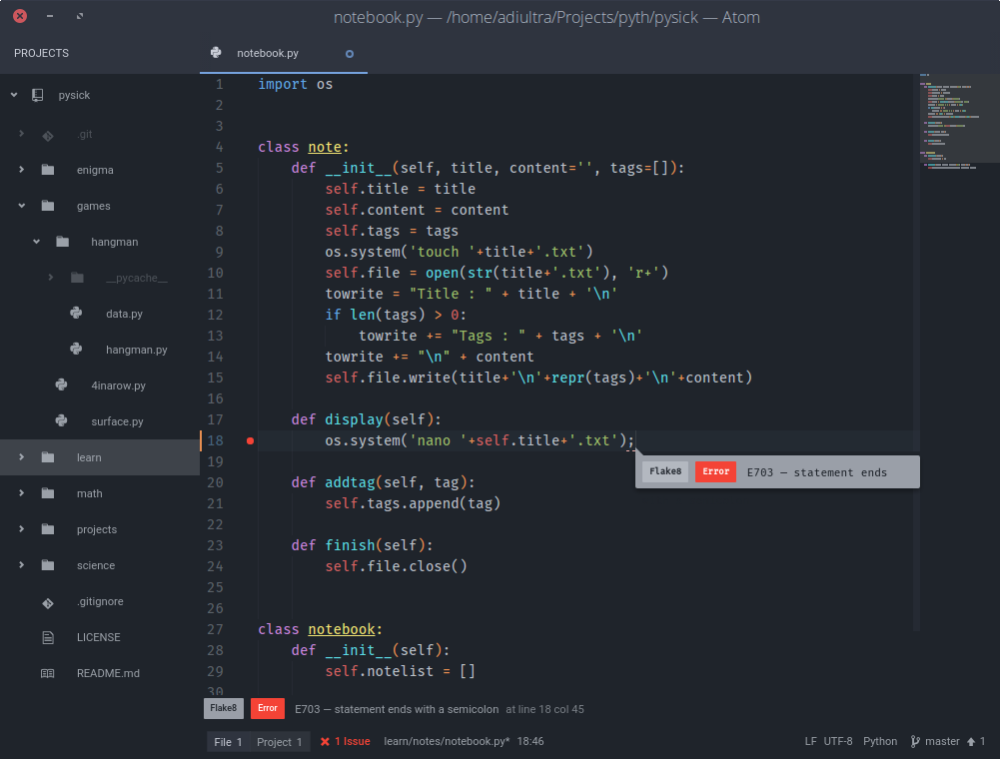

Title: Atom Review
Date: 2016-03-07

### _The Text Editor for the 21st century_

## Text editors _vs_ IDEs

Many indulge in the debate of text editors vs IDEs. I am partially biased towards text editors so this discussion would not be completely fair.

IDEs are applications which are geared towards software development in one or two languages only, with notable example of eclipse which supports lots of languages through plugins. IDEs contain every tool necessary (depends on your IDE) for a developer to create software and debug it. They are heavy and comparatively extremely slow to text editors.

On the other hand text editors focus more on source code editing than management of the software. They have features that facilitate code editing and don't boast of specialized features. Vim and emacs are perfect examples of text editors. It is also a common thing that nice text editors are easily extensible. For example vim can be turned into an IDE with the help of plugins for various languages.

## Where is Atom?

Atom is in between the text editor and IDE. It is also called Pseudo IDE, that is, it has functions of an IDE but usually behaves as a text editor. It is a text editor based on web technologies. For a __wild__ explanation it is a website running on chrome(ium to be exact) locally which can edit your text files. But don't mistake it to be a chromium addon, it is a complete app in itself. As I already said, it is a __wild__ definition. A more correct one is that it is a complete text editing app powered by web technologies, which means it is written in, C++, html, javascript, css, less, coffee-script, json etc. (Yeah it is a long list).

## Features

Atom's wealth of features clearly is amazing. The very greatest of its features is Modularity.

#### Modularity

Atom is hackable to the core. Its not just another Open Source project that has its source code available. It is as already told a web browser instance, so you edit atom and you see changes instantly, without compiling, and almost all developers have had an encounter with web languages(html, css etc.) so they can very easily extend atom. (I have written four themes for it! :smile:)

#### Git Integration

Atom has built in integration with git, it shows your branch, no of commits ahead of remote and several different stuff. It can be extended by using the plugin git-plus which allows to commit, push, view log and a dozen other stuff.

#### Support for various languages

Atom by default supports a huge bunch of languages. Even if it is written in web tech, it is not limited to it. And those delusive languages that don't have support already are having plugins in the apm( Atom Package Manager ).

#### Code completion, Auto Indent, And Basic Code editing Features

Atom packs in a bundle of code editing features that make life easier. It include code completion (auto-complete-plus), auto indent by default. It can be extended using minimap plugin, Beautify, color-selector etc.

#### Looks

Since atom is a local webapp (or something like that). It has amazing looks. The default theme of one-dark is nice, but I rather like the atom-material theme. Also there are currently 1,128 themes to choose from.

## My Atom

My atom setup is driven towards python. Here is a screenshot of it :

## Recomended plugins
